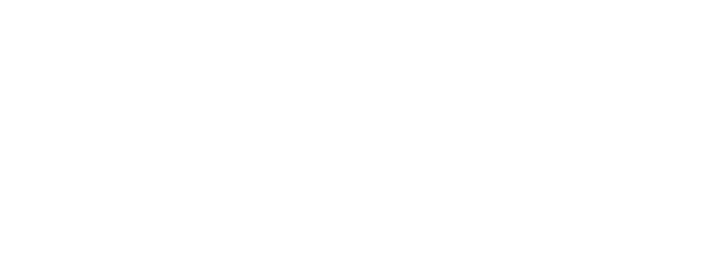

&nbsp;&nbsp; 

- 👋 Hi, I’m @billonalex
- 👀 I’m interested in Software Development, Web, mobile, scripts, SQL...
- 🌱 I’m currently learning React and API with Python
- 💞️ I’m looking to collaborate on many interesting projects which could challenge me !
- 📫 How to reach me : alexandre@billonprestations.fr

    

        CV détaillé
    

## EXPERIENCE PROFESSIONNELLE
### 09.2021 - aujourd'hui | Ingénieur de développement Web et mobile - Atol Conseils et Développements - Dijon
Tierce Maintenance Applicative et réalisation de projet sur l'éco système MesParcelles

### 09.2020 - 09.2021 | Développeur Web en alternance - Atol Conseils et Développements - Dijon
Tierce Maintenance Applicative et réalisation de projet sur l'éco système MesParcelles

### 07.2019 - 08.2019 | Maintenance ponctuelle - Chambre d’Agriculture de la Côte d’Or - Bretenière
Maintenance du serveur mis en place à la Chambre d’Agriculture à la suite de retours d’utilisation des services

### 07.2019 - 08.2019 | Stage - Chambre d’Agriculture de la Côte d’Or - Bretenière
Création d’une interface de gestion, Conception de site web, Administration d’un serveur ([www.apgmb.fr](https://www.apgmb.fr) – [gem.apgmb.fr](gem.apgmb.fr))

### 06.2017 - 07.2017 | Aide magasinier - Bronze Alu - La Couture-Boussey
Inventaire, déplacement des stocks, réorganisation des articles par famille

### 07.2016 | Aide magasinier - Bronze Alu - La Couture-Boussey
Inventaire, déplacement des stocks, création des nouvelles zones du magasin

&nbsp;&nbsp;

## FORMATION
### 2018 - 2021 – Ingénieur en Informatique – ESIREM Dijon
ESIREM - Spécialité Informatique / Electronique - Option ILC (Ingéniérie des Logiciels et des Connaissances)

### 2017 - 2018 – Cycle ingénieur - Limoges
3iL Ingénieurs - Première Année

### 2015 - 2017 – Classes Préparatoires aux Grandes Ecoles - Evreux
Option PSI (Physiques et Sciences de l’Ingénieur) – Lycée Aristide Briand

### 2015 – Baccalauréat Scientifiques
Mention Assez Bien – Lycée Aristide Briand

&nbsp;&nbsp;

## LANGUES
🇫🇷 🇬🇧

&nbsp;&nbsp;

## LOISIRS
Développement / Domotique / Musique / Impression 3D / Jeux vidéos

&nbsp;&nbsp;

| Quelques statistiques | | |
| :---: |:---:| :---:|
|      |  |  |

&nbsp;&nbsp;&nbsp;&nbsp; 

<!---
billonalex/billonalex is a ✨ special ✨ repository because its `README.md` (this file) appears on your GitHub profile.
You can click the Preview link to take a look at your changes.
--->
